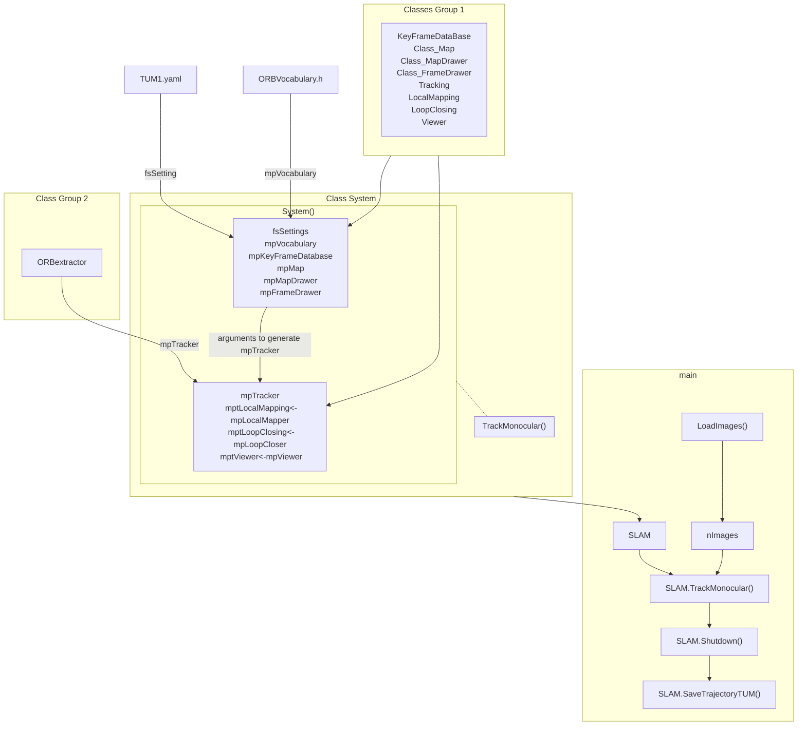
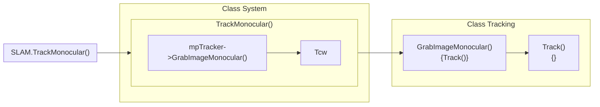

# 2 SLAM System Construction Functions

## 1. ORB_SLAM2 Source Code Structure

```
├── build_ros.sh
├── build.sh
├── CMakeLists.txt
├── cmake_modules
│   └── FindEigen3.cmake
├── Converter_cc.ps
├── Converter_h.ps
├── cscope
│   └── cscope.files
├── cscope.in.out
├── cscope.out
├── cscope.po.out
├── Dependencies.md
├── doc
│   └── Doxyfile
├── Documents
│   ├── 20200418_回环检测.pdf
│   ├── 20200421_ProcessNewKeyFrame函数.pdf
│   ├── 20200500_MapPointCulling函数.pdf
│   └── 20200508_CreateNewMapPoints函数.pdf
├── Examples
│   ├── Monocular
│   │   ├── EuRoC_TimeStamps
│   │   │   ├── MH01.txt
│   │   │   ├── MH02.txt
│   │   │   ├── MH03.txt
│   │   │   ├── MH04.txt
│   │   │   ├── MH05.txt
│   │   │   ├── V101.txt
│   │   │   ├── V102.txt
│   │   │   ├── V103.txt
│   │   │   ├── V201.txt
│   │   │   ├── V202.txt
│   │   │   └── V203.txt
│   │   ├── EuRoC.yaml
│   │   ├── KITTI00-02.yaml
│   │   ├── KITTI03.yaml
│   │   ├── KITTI04-12.yaml
│   │   ├── mono_euroc.cc
│   │   ├── mono_kitti.cc
│   │   ├── mono_tum.cc
│   │   ├── TUM1.yaml
│   │   ├── TUM2.yaml
│   │   └── TUM3.yaml
│   ├── RGB-D
│   │   ├── associations
│   │   │   ├── fr1_desk2.txt
│   │   │   ├── fr1_desk.txt
│   │   │   ├── fr1_room.txt
│   │   │   ├── fr1_xyz.txt
│   │   │   ├── fr2_desk.txt
│   │   │   ├── fr2_xyz.txt
│   │   │   ├── fr3_nstr_tex_near.txt
│   │   │   ├── fr3_office.txt
│   │   │   ├── fr3_office_val.txt
│   │   │   ├── fr3_str_tex_far.txt
│   │   │   └── fr3_str_tex_near.txt
│   │   ├── rgbd_tum.cc
│   │   ├── TUM1.yaml
│   │   ├── TUM2.yaml
│   │   └── TUM3.yaml
│   ├── ROS
│   │   ├── ORB_SLAM2
│   │   │   ├── Asus.yaml
│   │   │   ├── CMakeLists.txt
│   │   │   ├── manifest.xml
│   │   │   └── src
│   │   │       ├── AR
│   │   │       │   ├── ros_mono_ar.cc
│   │   │       │   ├── ViewerAR.cc
│   │   │       │   └── ViewerAR.h
│   │   │       ├── ros_mono.cc
│   │   │       ├── ros_rgbd.cc
│   │   │       └── ros_stereo.cc
│   │   └── Stereo
│   │       ├── EuRoC.yaml
│   │       ├── KITTI00-02.yaml
│   │       ├── KITTI03.yaml
│   │       ├── KITTI04-12.yaml
│   │       ├── stereo_euroc
│   │       ├── stereo_euroc.cc
│   │       ├── stereo_kitti
│   │       └── stereo_kitti.cc
│   └── Stereo
│       ├── EuRoC_TimeStamps
│       │   ├── MH01.txt
│       │   ├── MH02.txt
│       │   ├── MH03.txt
│       │   ├── MH04.txt
│       │   ├── MH05.txt
│       │   ├── V101.txt
│       │   ├── V102.txt
│       │   ├── V103.txt
│       │   ├── V201.txt
│       │   ├── V202.txt
│       │   └── V203.txt
│       ├── EuRoC.yaml
│       ├── KITTI00-02.yaml
│       ├── KITTI03.yaml
│       ├── KITTI04-12.yaml
│       ├── stereo_euroc.cc
│       └── stereo_kitti.cc
├── Examples_print_paper.odt
├── include
│   ├── Converter.h
│   ├── FrameDrawer.h
│   ├── Frame.h
│   ├── Initializer.h
│   ├── KeyFrameDatabase.h
│   ├── KeyFrame.h
│   ├── LocalMapping.h
│   ├── LoopClosing.h
│   ├── MapDrawer.h
│   ├── Map.h
│   ├── MapPoint.h
│   ├── Optimizer.h
│   ├── ORBextractor.h
│   ├── ORBmatcher.h
│   ├── ORBVocabulary.h
│   ├── PnPsolver.h
│   ├── Sim3Solver.h
│   ├── System.h
│   ├── Tracking.h
│   └── Viewer.h
├── include_print_paper.odt
├── LICENSE
├── LICENSE.txt
├── MapDrawer_h.ps
├── myqrcode.png
├── ORBextractor_CC.ps
├── 《ORB-SLAM2源码解析》学习手册.pdf
├── outline.png
├── README.md
├── sh.exe.stackdump
├── src
│   ├── Converter.cc
│   ├── Frame.cc
│   ├── FrameDrawer.cc
│   ├── Initializer.cc
│   ├── KeyFrame.cc
│   ├── KeyFrameDatabase.cc
│   ├── LocalMapping.cc
│   ├── LoopClosing.cc
│   ├── Map.cc
│   ├── MapDrawer.cc
│   ├── MapPoint.cc
│   ├── Optimizer.cc
│   ├── ORBextractor.cc
│   ├── ORBmatcher.cc
│   ├── PnPsolver.cc
│   ├── Sim3Solver.cc
│   ├── System.cc
│   ├── Tracking.cc
│   └── Viewer.cc
├── src_print_paper.odt
├── tags
├── Thirdparty
│   ├── DBoW2
│   │   ├── CMakeLists.txt
│   │   ├── DBoW2
│   │   │   ├── BowVector.cpp
│   │   │   ├── BowVector.h
│   │   │   ├── FClass.h
│   │   │   ├── FeatureVector.cpp
│   │   │   ├── FeatureVector.h
│   │   │   ├── FORB.cpp
│   │   │   ├── FORB.h
│   │   │   ├── ScoringObject.cpp
│   │   │   ├── ScoringObject.h
│   │   │   └── TemplatedVocabulary.h
│   │   ├── DUtils
│   │   │   ├── Random.cpp
│   │   │   ├── Random.h
│   │   │   ├── Timestamp.cpp
│   │   │   └── Timestamp.h
│   │   ├── LICENSE.txt
│   │   └── README.txt
│   └── g2o
│       ├── CMakeLists.txt
│       ├── cmake_modules
│       │   ├── FindBLAS.cmake
│       │   ├── FindEigen3.cmake
│       │   └── FindLAPACK.cmake
│       ├── config.h.in
│       ├── g2o
│       │   ├── core
│       │   │   ├── base_binary_edge.h
│       │   │   ├── base_binary_edge.hpp
│       │   │   ├── base_edge.h
│       │   │   ├── base_multi_edge.h
│       │   │   ├── base_multi_edge.hpp
│       │   │   ├── base_unary_edge.h
│       │   │   ├── base_unary_edge.hpp
│       │   │   ├── base_vertex.h
│       │   │   ├── base_vertex.hpp
│       │   │   ├── batch_stats.cpp
│       │   │   ├── batch_stats.h
│       │   │   ├── block_solver.h
│       │   │   ├── block_solver.hpp
│       │   │   ├── cache.cpp
│       │   │   ├── cache.h
│       │   │   ├── creators.h
│       │   │   ├── eigen_types.h
│       │   │   ├── estimate_propagator.cpp
│       │   │   ├── estimate_propagator.h
│       │   │   ├── factory.cpp
│       │   │   ├── factory.h
│       │   │   ├── hyper_dijkstra.cpp
│       │   │   ├── hyper_dijkstra.h
│       │   │   ├── hyper_graph_action.cpp
│       │   │   ├── hyper_graph_action.h
│       │   │   ├── hyper_graph.cpp
│       │   │   ├── hyper_graph.h
│       │   │   ├── jacobian_workspace.cpp
│       │   │   ├── jacobian_workspace.h
│       │   │   ├── linear_solver.h
│       │   │   ├── marginal_covariance_cholesky.cpp
│       │   │   ├── marginal_covariance_cholesky.h
│       │   │   ├── matrix_operations.h
│       │   │   ├── matrix_structure.cpp
│       │   │   ├── matrix_structure.h
│       │   │   ├── openmp_mutex.h
│       │   │   ├── optimizable_graph.cpp
│       │   │   ├── optimizable_graph.h
│       │   │   ├── optimization_algorithm.cpp
│       │   │   ├── optimization_algorithm_dogleg.cpp
│       │   │   ├── optimization_algorithm_dogleg.h
│       │   │   ├── optimization_algorithm_factory.cpp
│       │   │   ├── optimization_algorithm_factory.h
│       │   │   ├── optimization_algorithm_gauss_newton.cpp
│       │   │   ├── optimization_algorithm_gauss_newton.h
│       │   │   ├── optimization_algorithm.h
│       │   │   ├── optimization_algorithm_levenberg.cpp
│       │   │   ├── optimization_algorithm_levenberg.h
│       │   │   ├── optimization_algorithm_property.h
│       │   │   ├── optimization_algorithm_with_hessian.cpp
│       │   │   ├── optimization_algorithm_with_hessian.h
│       │   │   ├── parameter_container.cpp
│       │   │   ├── parameter_container.h
│       │   │   ├── parameter.cpp
│       │   │   ├── parameter.h
│       │   │   ├── robust_kernel.cpp
│       │   │   ├── robust_kernel_factory.cpp
│       │   │   ├── robust_kernel_factory.h
│       │   │   ├── robust_kernel.h
│       │   │   ├── robust_kernel_impl.cpp
│       │   │   ├── robust_kernel_impl.h
│       │   │   ├── solver.cpp
│       │   │   ├── solver.h
│       │   │   ├── sparse_block_matrix_ccs.h
│       │   │   ├── sparse_block_matrix_diagonal.h
│       │   │   ├── sparse_block_matrix.h
│       │   │   ├── sparse_block_matrix.hpp
│       │   │   ├── sparse_block_matrix_test.cpp
│       │   │   ├── sparse_optimizer.cpp
│       │   │   └── sparse_optimizer.h
│       │   ├── solvers
│       │   │   ├── linear_solver_dense.h
│       │   │   └── linear_solver_eigen.h
│       │   ├── stuff
│       │   │   ├── color_macros.h
│       │   │   ├── macros.h
│       │   │   ├── misc.h
│       │   │   ├── os_specific.c
│       │   │   ├── os_specific.h
│       │   │   ├── property.cpp
│       │   │   ├── property.h
│       │   │   ├── string_tools.cpp
│       │   │   ├── string_tools.h
│       │   │   ├── timeutil.cpp
│       │   │   └── timeutil.h
│       │   └── types
│       │       ├── se3_ops.h
│       │       ├── se3_ops.hpp
│       │       ├── se3quat.h
│       │       ├── sim3.h
│       │       ├── types_sba.cpp
│       │       ├── types_sba.h
│       │       ├── types_seven_dof_expmap.cpp
│       │       ├── types_seven_dof_expmap.h
│       │       ├── types_six_dof_expmap.cpp
│       │       └── types_six_dof_expmap.h
│       ├── license-bsd.txt
│       └── README.txt
└── Vocabulary
    └── ORBvoc.txt.tar.gz

```

## 2. Code Running Flow

The cod entrance starts from **ORB_SLAM2/Example/Monocular/mono_tum.cc**


# 3 Map Initialization
## 3.1 

## 3.2 Monocular Map Initialization Prosedure

We can see the **Track()** method in **Class Tracking**.
## 3.5 Getting Hemography Matrix $\mathbf{H}$ in Monocular Initialization
